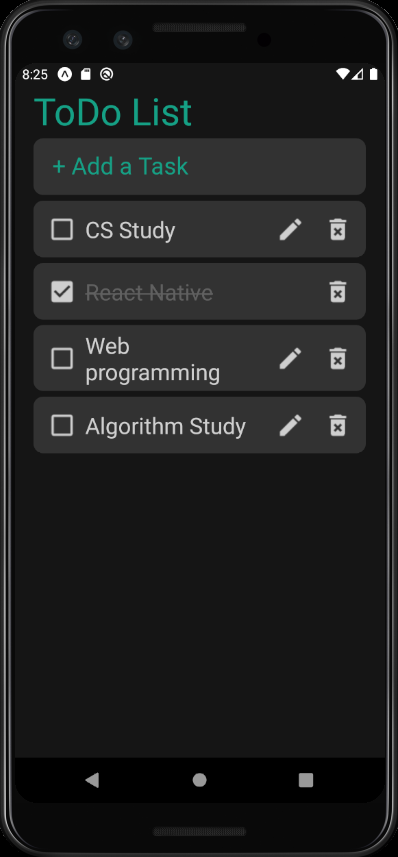

# React_Native

__[1.ToDo List](#ToDo_List)__  
__[2.Chat Application](#Chat_Application)__  
  
---

### 1. ToDo List<a id="ToDo_List"></a>
>추가, 수정, 삭제, 완료 여부등이 가능한 ToDo List

- 실행방법
```
cd ToDoList
npm install
npm start
```


### 2. Chat Application<a id="Chat_Application"></a>


---
